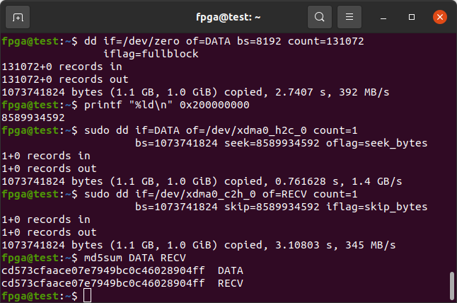

# Innova-2 Flex XCKU15P XDMA PCIe DDR4 GPIO Demo

This is a [Vivado 2023.1](https://www.xilinx.com/support/download/index.html/content/xilinx/en/downloadNav/vivado-design-tools/2023-1.html) starter project for the [XCKU15P FPGA](https://www.xilinx.com/products/silicon-devices/fpga/kintex-ultrascale-plus.html) on the [Innova-2 Flex SmartNIC MNV303212A-ADLT](https://www.nvidia.com/en-us/networking/ethernet/innova-2-flex/). It is a superset of the [`innova2_xdma_demo`](https://github.com/mwrnd/innova2_xdma_demo) project that implements DDR4 in addition to a PCIe XDMA interface to BRAM and a GPIO.

Refer to the [innova2_flex_xcku15p_notes](https://github.com/mwrnd/innova2_flex_xcku15p_notes/) project for instructions on setting up an Innova-2 system with all drivers including [Xilinx's PCIe XDMA Drivers](https://github.com/Xilinx/dma_ip_drivers).

Refer to [this tutorial](https://github.com/mwrnd/notes/tree/main/Vivado_XDMA_DDR4_Tutorial) for detailed instructions on generating a similar project from scratch.

A test version for the [4GB MNV303212A-ADIT variant is available](https://github.com/mwrnd/innova2_ddr4_troubleshooting/tree/main/test_adit_mt40a512m16).


# Block Design


# AXI Addresses


| Block                      | Address (Hex) | Size  |
| -------------------------- |:-------------:| :---: |
| `M_AXI` `BRAM_CTRL_0`      |  0x80000000   |   2M  |
| `M_AXI` `GPIO_0`           |  0x70100000   |  64K  |
| `M_AXI` `GPIO_1`           |  0x70110000   |  64K  |
| `M_AXI` `GPIO_2`           |  0x70120000   |  64K  |
| `M_AXI` `GPIO_4`           |  0x70140000   |  64K  |
| `M_AXI` `DDR4_0`           | 0x200000000   |   8G  |
| `M_AXI` `DDR4_CTRL_0`      |  0x70200000   |   1M  |
| `M_AXI_LITE` `BRAM_CTRL_1` |  0x00080000   |   8K  |
| `M_AXI_LITE` `GPIO_3`      |  0x00090000   |  64K  |


# Table of Contents

 * [Program the Design into the XCKU15P Configuration Memory](#program-the-design-into-the-xcku15p-configuration-memory)
 * [Testing the Design](#testing-the-design)
    * [lspci](#lspci)
    * [AXI BRAM Communication](#axi-bram-communication)
    * [AXI GPIO Control](#axi-gpio-control)
    * [DDR4 Communication and Throughput](#ddr4-communication-and-throughput)
       * [Test DDR4 Correct Data Retention](#test-ddr4-correct-data-retention)
       * [DDR4 Communication Error](#ddr4-communication-error)
    * [Custom Software for Accessing AXI Blocks](#custom-software-for-accessing-axi-blocks)
 * [Recreating the Design in Vivado](#recreating-the-design-in-vivado)
 * [Block Design Customization Options](#block-design-customization-options)
    * [XDMA](#xdma)
    * [DDR4](#ddr4)


## Program the Design into the XCKU15P Configuration Memory

Refer to the `innova2_flex_xcku15p_notes` project's instructions on [Loading a User Image](https://github.com/mwrnd/innova2_flex_xcku15p_notes/#loading-a-user-image). Binary Memory Configuration Bitstream Files are included in this project's [Releases](https://github.com/mwrnd/innova2_8gb_adlt_xdma_ddr4_demo/releases).

```
wget ...LINK...
wget ...LINK...
md5sum *bin
echo 6dd45e970a06a2037173f36fbc1a230f should be md5sum of innova2_8gb_adlt_xdma_ddr4_demo_primary.bin
echo 85417484e61cbd1fb55ec03ef18a8317 should be md5sum of innova2_8gb_adlt_xdma_ddr4_demo_secondary.bin
```


## Testing the Design

### lspci

After programming the bitstream and rebooting, the design should show up as `Memory controller: Xilinx Corporation Device 9038`. It shows up at PCIe Bus Address `03:00` for me.
```
lspci -d 10ee:
```


The following [lspci](https://manpages.ubuntu.com/manpages/jammy/man8/lspci.8.html) commands list all Mellanox and Xilinx devices and show their relation.
```
lspci -nn | grep "Mellanox\|Xilinx"
lspci -tv | grep "0000\|Mellanox\|Xilinx"
```


The FPGA is attached to a PCIe Bridge (`02:08.0`), as are the two Ethernet Controllers (`02:10.0`).
```
01:00.0 PCI bridge [0604]: Mellanox Technologies MT28800 Family [ConnectX-5 PCIe Bridge] [15b3:1974]
02:08.0 PCI bridge [0604]: Mellanox Technologies MT28800 Family [ConnectX-5 PCIe Bridge] [15b3:1974]
02:10.0 PCI bridge [0604]: Mellanox Technologies MT28800 Family [ConnectX-5 PCIe Bridge] [15b3:1974]
03:00.0 Memory controller [0580]: Xilinx Corporation Device [10ee:9038]
04:00.0 Ethernet controller [0200]: Mellanox Technologies MT27800 Family [ConnectX-5] [15b3:1017]
04:00.1 Ethernet controller [0200]: Mellanox Technologies MT27800 Family [ConnectX-5] [15b3:1017]

-[0000:00]-+-00.0  Intel Corporation Device 3e0f
           +-1d.0-[01-04]----00.0-[02-04]--+-08.0-[03]----00.0  Xilinx Corporation Device 9038
           |                               \-10.0-[04]--+-00.0  Mellanox Technologies MT27800 Family [ConnectX-5]
           |                                            \-00.1  Mellanox Technologies MT27800 Family [ConnectX-5]
```

The current PCIe Link status is useful. Note this is the FPGA to ConnectX-5 PCIe Bridge link.
```
sudo lspci -nnvd 10ee:  ;  sudo lspci -nnvvd 10ee: | grep Lnk
```


`dmesg | grep -i xdma` provides details on how Xilinx's PCIe XDMA driver has loaded.


### AXI BRAM Communication

The commands below generate 2MB of random data, then send it to a BRAM in the XCKU15P, then read it back and confirm the data is identical. Note `h2c` is *Host-to-Card* and `c2h` is *Card-to-Host*. From [AXI Addresses](#axi-ddresses) earlier, the BRAM is at `0x80000000`.
```Shell
cd ~/dma_ip_drivers/XDMA/linux-kernel/tools/
dd if=/dev/urandom bs=256 count=8192 of=TEST
sudo ./dma_to_device   --verbose --device /dev/xdma0_h2c_0 --address 0x80000000 --size 2097152  -f    TEST
sudo ./dma_from_device --verbose --device /dev/xdma0_c2h_0 --address 0x80000000 --size 2097152 --file RECV
md5sum TEST RECV
```


### AXI GPIO Control


The design includes an [AXI GPIO](https://docs.xilinx.com/v/u/3.0-English/ds744_axi_gpio) block to control Pin *B6*, the **D18** LED on the back of the Innova-2. The LED control is inverted on the board so the design includes a signal inverter. The LED can be turned on by writing a `0x01` to the `GPIO_DATA` Register. Only a single bit is enabled in the port so excess bit writes are ignored. No direction control writes are necessary as the port is set up for output-only (the `GPIO_TRI` Direction Control Register is fixed at `0xffffffff`).


The LED GPIO Block is connected to the **M_AXI_LITE** port so access to it is via 32-bit=1-word reads and writes to the **/dev/xdma0_user** file using the `reg_rw` utility from `dma_ip_drivers`. The commands below should turn on then turn off the *D18* LED in between reads of the GPIO register.
```Shell
sudo ./reg_rw /dev/xdma0_user 0x90000 w
sudo ./reg_rw /dev/xdma0_user 0x90000 w 0x0001
sudo ./reg_rw /dev/xdma0_user 0x90000 w
sudo ./reg_rw /dev/xdma0_user 0x90000 w 0x0000
sudo ./reg_rw /dev/xdma0_user 0x90000 w
```


### DDR4 Communication and Throughput

Memory Management prevents data reads from uninitialized memory. DDR4 must first be written to before it can be read from.

Your system must have enough free memory to test DDR4 DMA transfers. Run `free -m` to determine how much RAM you have available and keep the amount of data to transfer below that. The commands below generate 512MB of random data then transfer it to and from the Innova-2. The address of the DDR4 is `0x200000000` as noted earlier.

The [`dd`](https://manpages.ubuntu.com/manpages/trusty/man1/dd.1.html) command is used to generate a file (`of=DATA`) from pseudo-random data ([`if=/dev/urandom`](https://manpages.ubuntu.com/manpages/focal/en/man4/random.4.html)). The value for Block Size (`bs`) will be multiplied by the value for `count` to produce the size in bytes of the output file. For example, `8192*65536=536870912=0x20000000=512MiB`. Use a block size (`bs=`) that is a multiple of your drive's block size. `df .` informs you on which drive your current directory is located. `dumpe2fs` will tell you the drive's block size.

```Shell
df .
sudo dumpe2fs /dev/sda3 | grep "Block size"
```


Note `128MiB = 134217728 = 0x8000000` which can be generated with `dd` using the `bs=8192 count=16384` options.

To test the full 8GB of memory you can increment the address by the data size enough times that all `8Gib = 8589934592 = 0x200000000` has been tested.

If you have 8GB+ of free memory space, generate 8GB of random data with the `dd` command options `bs=8192 count=1048576` and test the DDR4 in one go.

`dd` uses decimal numbers. Convert from hexadecimal using [`printf`](https://manpages.ubuntu.com/manpages/trusty/man1/printf.1.html).

If checksums do not match, [`vbindiff DATA RECV`](https://manpages.ubuntu.com/manpages/jammy/man1/vbindiff.1.html) can be used to determine differences between the sent and received data and the failing address locations.

Note that data is loaded from your system drive into memory then sent to the Innova-2 DDR4 over PCIe DMA. Likewise it is loaded from the Innova-2's DDR4 into system RAM, then onto disk. The wall time of these functions can therefore be significantly longer than the DMA Memory-to-Memory over PCIe transfer time.
```Shell
cd ~/dma_ip_drivers/XDMA/linux-kernel/tools/
free -m
dd if=/dev/urandom bs=8192 count=65536 of=DATA
printf "%ld\n" 0x200000000
sudo dd if=DATA of=/dev/xdma0_h2c_0 count=1 bs=536870912 seek=8589934592 oflag=seek_bytes
sudo dd if=/dev/xdma0_c2h_0 of=RECV count=1 bs=536870912 skip=8589934592 iflag=skip_bytes
md5sum DATA RECV
```


The tools from `dma_ip_drivers` can also be used to run the same test:
```
cd dma_ip_drivers/XDMA/linux-kernel/tools  
free -m
dd if=/dev/urandom bs=8192 count=65536 of=DATA
sudo ./dma_to_device   --verbose --device /dev/xdma0_h2c_0 --address 0x200000000 --size 536870912 -f     DATA
sudo ./dma_from_device --verbose --device /dev/xdma0_c2h_0 --address 0x200000000 --size 536870912 --file RECV
md5sum DATA RECV
```


#### Test DDR4 Correct Data Retention


Test the first `1GB = 1073741824 bytes` of the DDR4 memory space using a binary all-zeros file.
```
cd ~/dma_ip_drivers/XDMA/linux-kernel/tools/
dd if=/dev/zero of=DATA bs=8192 count=131072
printf "%ld\n" 0x200000000
sudo dd if=DATA of=/dev/xdma0_h2c_0 count=1 bs=1073741824 seek=8589934592 oflag=seek_bytes
sudo dd if=/dev/xdma0_c2h_0 of=RECV count=1 bs=1073741824 skip=8589934592 iflag=skip_bytes
md5sum DATA RECV
```



Test the first `1GB = 1073741824 bytes` of the DDR4 memory space using a binary [all-ones file](https://stackoverflow.com/questions/10905062/how-do-i-get-an-equivalent-of-dev-one-in-linux).
```
cd ~/dma_ip_drivers/XDMA/linux-kernel/tools/
tr '\0' '\377' </dev/zero | dd of=DATA bs=8192 count=131072 iflag=fullblock
printf "%ld\n" 0x200000000
sudo dd if=DATA of=/dev/xdma0_h2c_0 count=1 bs=1073741824 seek=8589934592 oflag=seek_bytes
sudo dd if=/dev/xdma0_c2h_0 of=RECV count=1 bs=1073741824 skip=8589934592 iflag=skip_bytes
md5sum DATA RECV
```


#### DDR4 Communication Error

If you attempt to send data to the DDR4 address but get `write file: Unknown error 512` it means DDR4 did not initialize properly or the AXI bus has encountered an error and stalled. Proceed to the [Innova-2 DDR4 Troubleshooting](https://github.com/mwrnd/innova2_ddr4_troubleshooting) project.
```Shell
sudo ./dma_to_device --verbose --device /dev/xdma0_h2c_0 --address 0x0 --size 8192 -f TEST
```


### Custom Software for Accessing AXI Blocks

[innova2_xdma_ddr4_test.c](innova2_xdma_ddr4_test.c) is a simple program that demonstrates XDMA communication in [C](https://en.wikipedia.org/wiki/C_(programming_language)). It uses [`pread` and `pwrite`](https://manpages.ubuntu.com/manpages/jammy/en/man2/pread.2.html) to communicate with AXI Blocks. [`read` and `write`](https://manpages.ubuntu.com/manpages/jammy/en/man2/read.2.html) plus [`lseek`](https://manpages.ubuntu.com/manpages/jammy/en/man2/lseek.2.html) can also be used.

```
gcc -Wall innova2_xdma_ddr4_test.c -o innova2_xdma_ddr4_test -lm
sudo ./innova2_xdma_ddr4_test
```


## Recreating the Design in Vivado

Run the `source` command from the main Vivado **2023.1** window.

```
cd innova2_8gb_adlt_xdma_ddr4_demo
dir
source innova2_8gb_adlt_xdma_ddr4_demo.tcl
```


Click on *Generate Bitstream*.


Once the Bitstream is generated, run *Write Memory Configuration File*, select *bin*, *mt25qu512_x1_x2_x4_x8*, *SPIx8*, *Load bitstream files*, and a location and name for the output binary files. The bitstream will end up in the `innova2_xdma_demo/innova2_xdma_demo.runs/impl_1` directory as `xdma_wrapper.bit`. Vivado will add the `_primary.bin` and `_secondary.bin` extensions as the Innova-2 uses dual MT25QU512 FLASH ICs in x8 for high speed programming.


Proceed to [Loading a User Image](https://github.com/mwrnd/innova2_flex_xcku15p_notes/#loading-a-user-image)


## Block Design Customization Options

### XDMA

The Innova-2's XCKU15P is wired for **x8** PCIe at *PCIe Block Location:* **X0Y2**. It is capable of **8.0 GT/s** Link Speed.


For this design I set the PCIe *Base Class* to **Memory Controller** and the *Sub-Class* to **RAM**.


I disable the **Configuration Management Interface**.


### DDR4

The DDR4 Memory Part is selected as `MT40A1G16WBU-083E` which is compatible with the [MT40A1G16KNR-075](https://media-www.micron.com/-/media/client/global/documents/products/data-sheet/dram/ddr4/ddr4_16gb_x16_1cs_twindie.pdf) x16 Twin Die ICs with [`D9WFR` FBGA Code](https://www.micron.com/support/tools-and-utilities/fbga?fbga=D9WFR#pnlFBGA) on the Innova-2.


The DDR4 is configured for a Memory Speed of **1428**ps = 700MHz = 1400 MT/s Transfer Rate. The DDR4 reference clock is **9996**ps = 100.04MHz.


*Data Mask and DBI* is set to **NO DM DBI WR RD** which automatically enables ECC on a 72-Bit interface.


The *Arbitration Scheme* is set to **Round Robin** under AXI Options.


